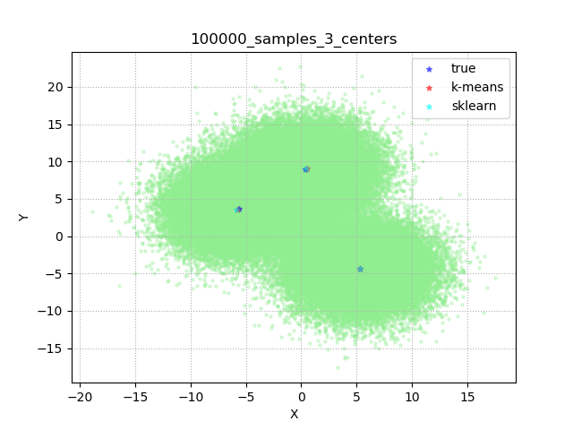

# Datasets

These datasets have been synthetically generated with the help of [scikit-learn](https://scikit-learn.org/stable/modules/generated/sklearn.datasets.make_blobs.html). They are extremely simple and lightweight and are not meant to represent any real-world scenario.

They are employed just for the sake of testing the base functionalities of this implementation.

This is, for example, the plot for the `./datasets/2d/100000_samples_3_centers` data:



The legend shows 3 entries: the `true` label, which represents the true centroids, the `k-means` label, which represents the centroids returned by the algorithm and the `sklearn` label, which represents the centroids returned by [scikit-learn](https://scikit-learn.org/stable/modules/generated/sklearn.cluster.KMeans.html).


At the moment only synthetic data for 2D and 3D are provided, in the form of CSV files where every row stores a 2D/3D vector of comma-separated real values like

```
-5.225411857944791016e+00,-3.282735505744529547e-01
4.854587981332405100e+00,-5.008893642316682993e+00
4.207228249882383864e+00,-4.796811953648405513e+00
..., ...
```